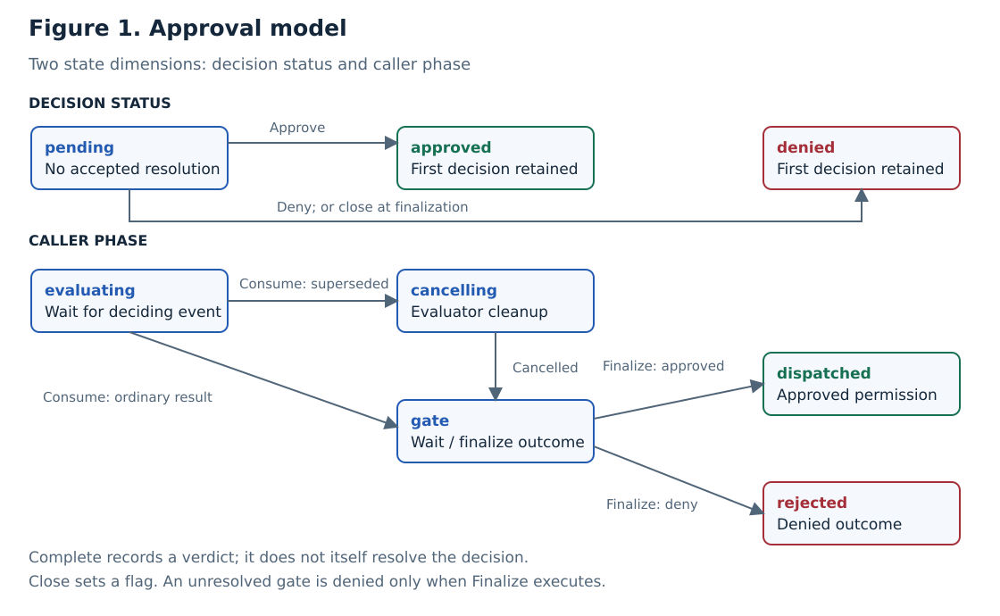
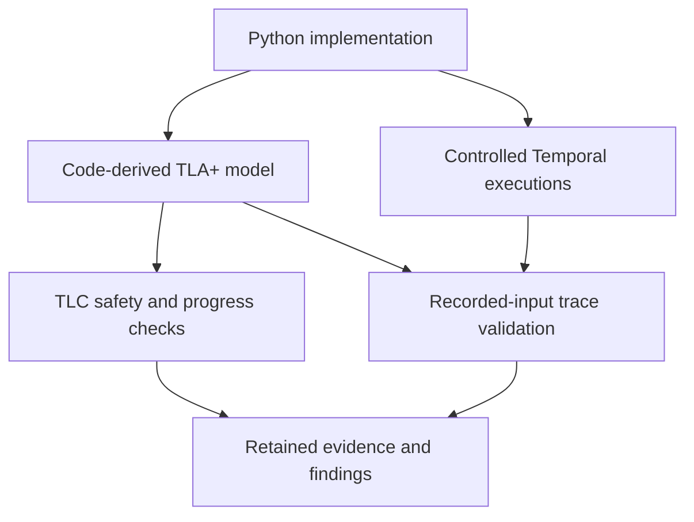

# Verifying approval, cancellation, and upgrades in Temporal Agent Harness

## Current scientific search

The [external recovery investigation](research/evaluation/recovery-investigation.md)
reproduces a known live/replay defect and retains complete histories. Its
[72-execution comparison](research/evaluation/recovery-comparison-results.md) found
no advantage for the tested systematic schedule heuristic: random selection matched
or beat its detection budget, and the adapted known regression detected immediately.
All 36 fixed-release trials replayed successfully. This candidate advantage is
rejected for the pilot; scientific novelty remains unestablished. The approval case
below remains prior evidence, whose reduction and composition analyses also did not
establish novelty.

The [mechanism comparison](research/evaluation/recovery-mechanism-comparison.md)
now identifies the next concrete problem: our 72 histories are all completed, while
source reports describe failures involving still-running recovery, result identity,
and stalled progress. The next candidate is automatic selection of recovery points
and legal continuations. Existing work already supports recovery and progress checks;
novelty would require a demonstrably better derivation or reduction method.

## Start here

**An approved tool invocation can still need to stop. A correction that stops new
invocations can still be incompatible with an old workflow's durable history.**

This case study follows those two problems in Temporal Agent Harness. A human
approves a call while its evaluator is running. The harness cancels the evaluator
and waits for cleanup. If the caller is cancelled during that wait, the baseline
can swallow cancellation and continue to the tool. Approval remains intact; the
invocation contract fails. When the tool is a real activity, directly fixing this
behavior can conflict with commands already recorded by the old code.

Read the [one-call walkthrough](research/walkthrough.md) first. It connects the
source functions, an actual five-state model counterexample, the properties it
preserves and violates, and the implementation and upgrade evidence. The
[storyline and claim ledger](research/storyline.md) explains the central argument,
its evidence boundaries, and the remaining review work.

| Question | What answers it here |
| --- | --- |
| Was the call permitted? | Approval/Cascade models and decision-safety checks |
| Should this invocation still execute after caller cancellation? | Cleanup model, concrete cancellation tests, and fresh activity runs |
| Can replacement code replay already-recorded work? | A bounded History model checked against retained replay cells; live worker-replacement experiments remain separate |

The models are manually derived from Python; their finite checks are not a proof of
implementation refinement. The strongest measured result is the specific history
constraint and bounded versioned remedy in the [activity report](research/evaluation/activity-results.md).
The defects were inspection-led, not discovered by TLC. Formal-method superiority
and publication novelty remain unestablished.

The original baseline is `049e01c9d726ef68bff7be857c735723b9801512`; its MIT license
is retained. The malformed-result guard is applied on this research branch. The
caller-cancellation corrections remain isolated experiment patches. Nothing has
been merged or submitted to the original upstream.

## System and abstraction

**Figure 1.** Decision status and caller phase are distinct. Approval settles the
permission decision; it does not complete evaluator cancellation. Closure sets a
flag; an unresolved call becomes denied when gate finalization executes.

The model begins with registered, gated calls and running evaluators. It abstracts
LLM reasoning into a nondeterministic verdict. `dispatched` means permission to
execute the tool, rather than a committed external effect. Trusted operator inputs
and stable call identities are assumptions.

## Contract and properties

The contract preserves the **first accepted resolution**. A restrictive policy update
changes eligibility without revoking accepted approvals. An unresolved gate closes
as denied; an approval accepted before finalization can still stand after closure.

| Obligation | Meaning | Kind |
| --- | --- | --- |
| DecisionStable | A later event cannot replace the first accepted outcome. | Safety |
| SingleResolution | Each call resolves at most once. | Safety |
| AuthorizedDispatch | Dispatch requires an approved outcome. | Safety |
| DeniedNeverDispatches | A denied call cannot dispatch. | Safety |
| ScopePreserved | A policy cascade releases only eligible calls. | Safety |
| CauseBeforeCascade | A remembered decision publishes before its siblings. | Safety |
| ResolutionProgress | A settled or closed gate eventually reaches a caller outcome, under explicit fairness assumptions. | Conditional liveness |
| CallerCancellationRespected | Cancellation received by the caller during cleanup, before dispatch, prevents dispatch. Accepted approval remains unchanged. | Safety |

The [property catalogue](research/properties.md) gives the formulas, assumptions,
violating examples, and checks. Type consistency is checked separately.

## Formal models

For state vector $v$, the models have the standard behavior specification

$$
\mathrm{Spec} = \mathrm{Init} \land \Box[\mathrm{Next}]_v.
$$

Here, $\Box$ means “always,” and $[\mathrm{Next}]_v$ allows a model action or a
stuttering step that leaves $v$ unchanged. Safety excludes bad reachable states;
liveness constrains infinite behaviors under stated scheduling assumptions.

| Model | State and purpose | Detailed definition |
| --- | --- | --- |
| Approval | Per-call decision, evaluator, and caller phase; shared closure flag. Checks human/evaluator/closure competition. | [State variables and transitions](research/models/approval/README.md) |
| Cascade | Extends Approval with tool eligibility and resolution history. Checks remembered approvals, policy replacement, and publication order. | [Extension and atomic actions](research/models/cascade/README.md) |
| Cleanup | One-call extension separating accepted permission, cleanup termination, and caller cancellation. | [State, obligations, and counterexamples](research/models/cancellation/README.md) |
| History | Separate boundary model of fresh commands, patch markers, effects, and replay. | [Assumptions and finite checks](research/models/history/README.md) |

## Method and evidence

**Figure 4.** Model checking explores the abstraction. Trace validation asks whether
recorded implementation inputs and partial states admit a legal model execution.
It cannot establish universal implementation refinement.

The verified artifact includes **82 selected tests, 13 model configurations,
31 matching traces, eight rejected invalid traces, and four detected Python faults**.
Exact commits, CI links, experiment coverage, and commands are centralized in
[Evidence and reproduction](research/evidence.md).

An assumption audit also found a concrete robustness defect: a malformed evaluator
result could abort an already-settled gate. A type guard and regressions fix it.
The [finding and minimal patch](research/upstream/superseded-result.md) distinguish
this inspection-led discovery from model-checker findings.

A second inspection-led finding reproduces **tool execution after caller cancellation
during evaluator cleanup**. Decision safety still holds, exposing a missing invocation
obligation. An isolated correction prevents dispatch and closes the evaluation audit
record. The [cancellation study](research/evaluation/cancellation-results.md) retains
six expected TLC results, 23 tests per implementation variant, 375 harness regressions
against the isolated correction, and sixteen completed
history replays per variant. The [standalone upstream packet](research/upstream/caller-cancellation.md)
contains a minimal patch and regressions; it has not been submitted or applied to
production source on this branch.

A subsequent [cross-version replay experiment](research/evaluation/upgrade-results.md)
replayed all 32 retained histories under both source variants. All 64 cells passed
command replay, but four reconstructed a different caller outcome and tool-start
count. Same-version controls matched. This demonstrates an application-observation
gap for the workflow-local probe, not a Temporal defect or external-effect failure.
The experiment and observer-free controls passed locally and in
[GitHub Actions](https://github.com/charifmahmoudi/temporal-agent-harness/actions/runs/37933221643),
which reproduced every categorical outcome. Both evidence archives are retained.

The [activity-backed extension](research/evaluation/activity-results.md) then tests
durable commands and an actual test-ledger effect. It retains 12 fresh executions,
36 replay cells, and eight live nonsticky worker replacements. The versioned source
also passes all 375 existing harness regressions. Unlike the workflow-local probe,
the direct correction encounters explicit command nondeterminism when old activity
history must be replayed. These are distinct probes and results, not a contradiction.

The [model-connection follow-up](research/evaluation/model-bridges.md) checks four
retained cancellation traces directly against Cleanup, rejects eight model controls
and seven invalid records, and adds a separate History model. Twelve expected TLC
results include agreement with all 36 retained replay cells. These are retrospective
checks over existing evidence, not new independent reproduction or a refinement proof.

## Active scientific question

The [contribution search](research/evaluation/scientific-contribution-search.md)
asks whether replay obligations and implementable repair conditions can be derived
soundly from asynchronous source code. Its first executable pilot diagnoses a
conflict between two retained cohorts under a declared observation vocabulary.
The pilot's finite consistency algorithm is established reasoning, not a new method;
source-level derivation and scientific novelty remain unestablished. This research
objective has not been replaced by an engineering-report objective.

The [source-boundary follow-up](research/evaluation/repair-boundary.md) derives a
conditional decision slice and checks nine lexical function inventories. It identifies
the missing link between history-derived inputs and actual cancellation/SDK reads,
and compares source extraction, update merging, and finite registration precedents.
Automatic semantic certification remains unsupported; novelty is still unestablished.

The [paired encoding comparison](research/evaluation/encoding-comparison.md) then
found agreement across 7,290 declared cases and 58,320 symbolic word cells. It rejects
the local Boolean reduction as a standalone contribution: the conventional encoding
handles the same domain. Source correspondence and a demonstrated advantage over
existing analyses remain the unresolved scientific requirements.

The [minimal composition argument](research/evaluation/composition-argument.md)
also rejects composition alone as the contribution: ordinary contract conjunction
explains the conflict, and explicitly scoping cancellation to newly executing behavior
removes it for the approved historical command. This does not establish that a
compatible repair is implementable from the observations available in code.

## Scientific scope and next evidence

The evidence supports bounded model properties, controlled trace conformance, and
selected regression sensitivity. It does not establish arbitrary-call correctness,
universal Temporal replay correctness, external-effect atomicity, operator authentication,
or semantic correctness of evaluator judgments.

Trace validation and formal agent enforcement have substantial precedents; the
[related-work comparison](research/related-work.md) defines the contribution boundary.
The [first comparative experiment](research/evaluation/results-v1.md) is now complete.
On six selected Python faults, existing tests detected two, expanded tests detected
five under a conservative assertion-only rule, and trace checks rejected three.
Two trace collectors were inconclusive and one fault was outside model scope.
There were **no trace-only detections beyond both test arms**. The
[assessment](research/evaluation/assessment.md) explains this result. The subsequent
cancellation study adds a real defect, a separate lifecycle obligation, and an explicit
cleanup-dependent progress limitation. It supports a focused implementation case study;
it does not reverse the comparison's negative result. Independent abstraction review,
external reproduction, and broader policy/recovery coverage remain necessary; superior
detection and conference novelty are not established.

A [focused claim-by-claim literature comparison](research/evaluation/novelty-review.md)
is complete. It finds direct precedents for the component methods and leaves novelty
unestablished. The [pinned review quickstart](research/evaluation/review-quickstart.md)
and response template are ready; no invitation has been sent and no independent
review is claimed. [Second-case execution](research/evaluation/prospective-case.md)
is deferred until selection and predictions are fixed without observing outcomes.

The next evidence milestones are concrete:

| Priority | Work | Why it matters / completion criterion |
| --- | --- | --- |
| 1 | Independent review and reproduction of the cancellation case | A reviewer challenges the cancellation contract, atomic boundaries, and retained counterexamples; another environment reproduces the categorical outcomes. |
| 2 | Maintainer assessment of both minimal patches | Confirm intended behavior and practical usefulness. Record actual feedback separately from scientific validation. Submission remains pending. |
| 3 | Review the supported migration cohorts and routing assumptions | The activity-backed cases pass for B → V, but not all C → V or rollback histories. Assess production routing, retry policy, and additional history cohorts before deployment claims. |

Broader modeling follows evidence of a missing obligation, rather than a target test
count. A paper should center the reproduced discrepancies and contract lessons; any
claim of a new verification method requires further evidence against the closest work.

## Reading path

Begin with the [walkthrough](research/walkthrough.md) and [storyline](research/storyline.md).
The following references supply the details behind that example.

1. [Approval model](research/models/approval/README.md) → [Cascade model](research/models/cascade/README.md): understand the state machines.
2. [Properties](research/properties.md): inspect the mathematical obligations and counterexamples.
3. [Code correspondence](research/correspondence.md) → [Evidence](research/evidence.md): assess fidelity and reproduce results.
4. [Related work](research/related-work.md) → [Critical assessment](research/review-assessment.md): evaluate novelty and unresolved claims.
5. [Comparative protocol](research/evaluation/protocol.md) → [Results](research/evaluation/results-v1.md) → [Assessment](research/evaluation/assessment.md): inspect measured added value.
6. [Cleanup model](research/models/cancellation/README.md) → [Cancellation results](research/evaluation/cancellation-results.md) → [Minimal patch](research/upstream/caller-cancellation.md): inspect the new lifecycle finding and its remedy.
7. [Upgrade protocol](research/evaluation/upgrade-protocol.md) → [Replay results](research/evaluation/upgrade-results.md): distinguish command compatibility from application agreement under changed code.
8. [Activity protocol](research/evaluation/activity-protocol.md) → [Activity and live-upgrade results](research/evaluation/activity-results.md): inspect the durable-command mismatch, versioned remedy, and migration limits.

[Maintenance policy and decision gates](research/maintenance.md) define how future
changes update the scientific artifact. An [independent-review packet](research/evaluation/review-packet.md)
is ready; no external review is claimed.
