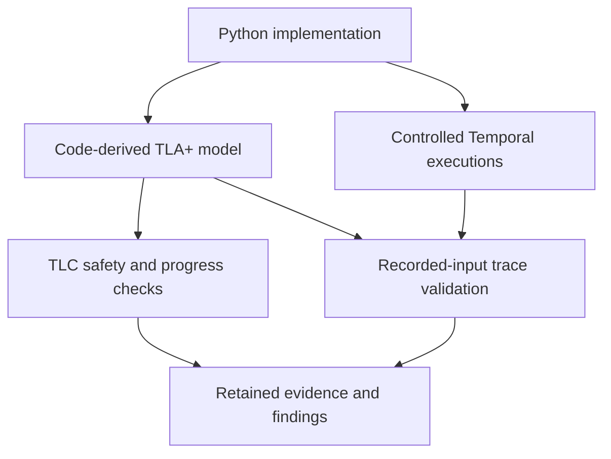

# Verifying tool-approval races in Temporal Agent Harness

## Research question

**Does an accepted tool decision remain stable when human responses, evaluator
completion, policy changes, and closure overlap?**

Temporal Agent Harness runs agents as durable workflows. Before a gated tool runs,
a human or automatic evaluator may approve or deny it. Several operations can compete
for that decision. An approval may also change policy and release other waiting calls.
Correctness therefore concerns both the accepted outcome and the order of subsequent
cleanup, publication, and dispatch.

This case study defines that contract in TLA+, checks finite models, and tests their
correspondence with controlled executions of the Python implementation. The models
are manually derived from code. The original baseline is
`049e01c9d726ef68bff7be857c735723b9801512`; its MIT license is retained.

## System and abstraction

**Figure 1.** Decision status and caller phase are distinct. Approval settles the
permission decision; it does not complete evaluator cancellation. Closure sets a
flag; an unresolved call becomes denied when gate finalization executes.

The model begins with registered, gated calls and running evaluators. It abstracts
LLM reasoning into a nondeterministic verdict. `dispatched` means permission to
execute the tool, rather than a committed external effect. Trusted operator inputs
and stable call identities are assumptions.

## Contract and properties

The contract preserves the **first accepted resolution**. A restrictive policy update
changes eligibility without revoking accepted approvals. An unresolved gate closes
as denied; an approval accepted before finalization can still stand after closure.

| Obligation | Meaning | Kind |
| --- | --- | --- |
| DecisionStable | A later event cannot replace the first accepted outcome. | Safety |
| SingleResolution | Each call resolves at most once. | Safety |
| AuthorizedDispatch | Dispatch requires an approved outcome. | Safety |
| DeniedNeverDispatches | A denied call cannot dispatch. | Safety |
| ScopePreserved | A policy cascade releases only eligible calls. | Safety |
| CauseBeforeCascade | A remembered decision publishes before its siblings. | Safety |
| ResolutionProgress | A settled or closed gate eventually reaches a caller outcome, under explicit fairness assumptions. | Conditional liveness |

The [property catalogue](research/properties.md) gives the formulas, assumptions,
violating examples, and checks. Type consistency is checked separately.

## Formal models

For state vector $v$, both models have the standard behavior specification

$$
\mathrm{Spec} = \mathrm{Init} \land \Box[\mathrm{Next}]_v.
$$

Here, $\Box$ means “always,” and $[\mathrm{Next}]_v$ allows a model action or a
stuttering step that leaves $v$ unchanged. Safety excludes bad reachable states;
liveness constrains infinite behaviors under stated scheduling assumptions.

| Model | State and purpose | Detailed definition |
| --- | --- | --- |
| Approval | Per-call decision, evaluator, and caller phase; shared closure flag. Checks human/evaluator/closure competition. | [State variables and transitions](research/models/approval/README.md) |
| Cascade | Extends Approval with tool eligibility and resolution history. Checks remembered approvals, policy replacement, and publication order. | [Extension and atomic actions](research/models/cascade/README.md) |

## Method and evidence

**Figure 4.** Model checking explores the abstraction. Trace validation asks whether
recorded implementation inputs and partial states admit a legal model execution.
It cannot establish universal implementation refinement.

The verified artifact includes **82 selected tests, 13 model configurations,
31 matching traces, eight rejected invalid traces, and four detected Python faults**.
Exact commits, CI links, experiment coverage, and commands are centralized in
[Evidence and reproduction](research/evidence.md).

An assumption audit also found a concrete robustness defect: a malformed evaluator
result could abort an already-settled gate. A type guard and regressions fix it.
The [finding and minimal patch](research/upstream/superseded-result.md) distinguish
this inspection-led discovery from model-checker findings.

## Scientific scope and next experiment

The evidence supports bounded model properties, controlled trace conformance, and
selected regression sensitivity. It does not establish arbitrary-call correctness,
Temporal replay correctness, external-effect atomicity, operator authentication,
or semantic correctness of evaluator judgments.

Trace validation and formal agent enforcement have substantial precedents; the
[related-work comparison](research/related-work.md) defines the contribution boundary.
The [first comparative experiment](research/evaluation/results-v1.md) is now complete.
On six selected Python faults, existing tests detected two, expanded tests detected
five under a conservative assertion-only rule, and trace checks rejected three.
Two trace collectors were inconclusive and one fault was outside model scope.
There were **no trace-only detections beyond both test arms**. The
[assessment](research/evaluation/assessment.md) explains this result and the required
next experiment. Independent abstraction review and broader policy/replay coverage
remain necessary; superior detection and conference novelty are not established.

## Reading path

1. [Approval model](research/models/approval/README.md) → [Cascade model](research/models/cascade/README.md): understand the state machines.
2. [Properties](research/properties.md): inspect the mathematical obligations and counterexamples.
3. [Code correspondence](research/correspondence.md) → [Evidence](research/evidence.md): assess fidelity and reproduce results.
4. [Related work](research/related-work.md) → [Critical assessment](research/review-assessment.md): evaluate novelty and unresolved claims.
5. [Comparative protocol](research/evaluation/protocol.md) → [Results](research/evaluation/results-v1.md) → [Assessment](research/evaluation/assessment.md): inspect measured added value.

[Maintenance policy and decision gates](research/maintenance.md) define how future
changes update the scientific artifact. An [independent-review packet](research/evaluation/review-packet.md)
is ready; no external review is claimed.
