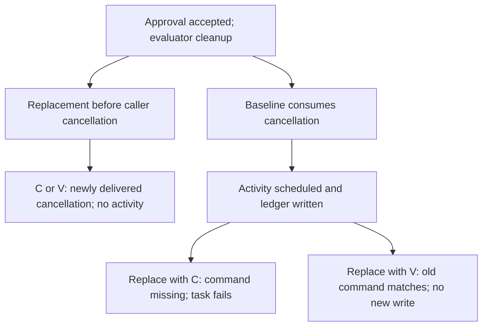

# Fixing cancellation without breaking durable history

[Case study](../../RESEARCH.md) · [Frozen protocol v4](activity-protocol.md) · [Properties](../properties.md)

## Finding

**The baseline can execute an activity after caller cancellation. A direct correction
prevents new execution but cannot replay the old activity-bearing history. A patch-
versioned correction preserves that history while enforcing cancellation on the new path.**

This is a concrete deployment constraint on the proposed fix. It is not a new Temporal
defect, a novel versioning technique, or evidence that a production deployment was affected.
The experiment uses a real harness activity tool and a test-only filesystem ledger.

Three implementation variants share the same workflow and stimuli:

| Variant | Behavior |
| --- | --- |
| B — baseline | Can consume the caller's cancellation during evaluator cleanup |
| C — direct correction | Propagates outstanding caller cancellation |
| V — versioned correction | Uses the existing SDK patch mechanism at the changed cancellation branch; preserves the old branch for unmarked baseline replay |

All corrections remain in isolated source copies. Production code on this branch
is unchanged by this experiment.

## Fresh execution: permission and cancellation are separate

| Scenario | B outcome; activity/ledger count | C outcome; activity/ledger count | V outcome; activity/ledger count |
| --- | --- | --- | --- |
| Ordinary approval | dispatched; 1 / 1 | dispatched; 1 / 1 | dispatched; 1 / 1 |
| Ordinary denial | rejected; 0 / 0 | rejected; 0 / 0 | rejected; 0 / 0 |
| Caller cancelled; child re-raises | dispatched; 1 / 1 | cancelled; 0 / 0 | cancelled; 0 / 0 |
| Caller cancelled; child returns | dispatched; 1 / 1 | cancelled; 0 / 0 | cancelled; 0 / 0 |

Both cancellation scenarios retain approved status and exactly one evaluation terminal
in every variant. The baseline cancellation signal is event 15, activity scheduling
is event 19, and completion is event 25. A recorded cleanup flag and second-cancellation
flag establish delivery, rather than treating a client request as sufficient evidence.
The activity writes and fsyncs one ledger record outside workflow memory. Server
history independently confirms scheduling and completion. V records patch identifier
`approval-caller-cancel-v1` on its new cancellation path.

## Replay: fresh-execution correctness is insufficient for an upgrade

Every one of the twelve fresh histories was replayed under every variant: **36 cells,
26 compatible and ten explicit nondeterminism results**. All twelve same-version
controls pass. The table shows compatible histories out of four per cell:

| History producer | Replay with B | Replay with C | Replay with V |
| --- | --- | --- | --- |
| baseline | 4 / 4 | 2 / 4 | 4 / 4 |
| corrected | 2 / 4 | 4 / 4 | 2 / 4 |
| versioned | 2 / 4 | 2 / 4 | 4 / 4 |

Ordinary approval and denial are compatible in every direction. Incompatible cells
are the two caller-cancellation scenarios. For baseline history replayed under C,
the SDK explicitly reports **no command scheduled for event 19, ActivityTaskScheduled**.
The corrected code exits through cancellation and omits the command that the old
history requires. This is expected enforcement of Temporal's command contract.

V is compatible with all B histories and its own histories, but **not all histories
already produced by C**. C's unmarked cancellation history cannot be interpreted as
baseline dispatch history. Conversely, removing V's marker-aware code is not a
validated rollback path. The matrix therefore supports B → V for these cases, not
arbitrary migration among three versions.

## Live replacement: the durable boundary determines the outcome

The old worker is stopped gracefully; the new worker runs in a separate process
with verified source imports and workflow caching disabled. A checkpoint signal
forces reconstruction. Each row was exercised with both child cancellation responses.

| Baseline replacement point | New C worker | New V worker | Ledger after replacement |
| --- | --- | --- | --- |
| Cleanup entered; caller cancellation not yet delivered | New cancellation prevents scheduling | New cancellation prevents scheduling | 0 in all four cases |
| Activity completed; agent session still open | Workflow task fails with explicit nondeterminism | Old dispatch replays; session closes normally | Existing 1 retained; no second write in all four cases |

There are **eight live replacements**: six compatible recoveries and two explicit
nondeterministic workflow-task failures. Failed-task event 32 identifies the omitted
activity command. Those workflows are administratively terminated only after the
failure history is retained; termination is test cleanup, not a recovery outcome.
Final histories and final ledgers are checked after closing/termination, not only
at an early query. No additional activity schedule or ledger write was observed.



**Figure.** The accepted approval is unchanged along both branches. The relevant
upgrade boundary is whether the cancellation-sensitive activity command is already
part of history. Only the two stated replacement points were tested.

## Obligations and their limits

For invocation i, D(i) means caller cancellation delivered during cleanup, S(i)
means a scheduled activity command, and E(i) means the recorded ledger effect.
For a newly executing corrected branch, the required safety obligation is

$$D(i)\Rightarrow\neg S(i).$$

The baseline supplies two counterexamples with D(i), S(i), and E(i). C and V satisfy
the obligation for the tested fresh and pre-cancellation replacement executions.
These are implementation experiments, not a proof over all schedules.

Let R(h,v) mean command-compatible replay of history h under version v. The
baseline caller histories provide witnesses to

$$R(h,B)\land\neg R(h,C)\land R(h,V).$$

Versioning preserves historical commands; it does not retroactively make those
commands satisfy the new cancellation contract. V intentionally reproduces the old
dispatch during baseline replay without executing the completed activity again.
Preserving old history and preventing future dispatch are distinct obligations.
The earlier Cleanup TLA+ model checks invocation cancellation; it does not model
history matching, activity retries, or patch-marker semantics. No new refinement
proof or model-led discovery is claimed.

## Evidence, validation, and reproduction

The final measured [CI run 37936970956](https://github.com/charifmahmoudi/temporal-agent-harness/actions/runs/37936970956) used
PR head `040dde3ac8ae1a3451eb0c91f2af2343a173c48e` and checkout
`3125452790cf553b632a4f9aa91b41a923891fcd` (the PR merge revision).
All 375 existing harness regressions passed against isolated V source;
three experiment-scoring controls also pass. The frozen lockfile specifies Temporal
SDK 1.32.0. The time-skipping server's simulated timestamps are not wall-clock
measurements; causal claims use delivered-input state and event IDs.

The [retained archive](activity-evidence.zip) contains all histories, live prefixes,
worker logs, ledger writes, replay diagnostics, source manifests, proposed diffs,
and regression JUnit results. The [provenance record](activity-results.json) identifies
the protocol commit, exact artifact digest, and measured revision. Documentation CI
recomputes counts and outcome tables from the raw records and verifies source hashes.

```bash
uv sync --frozen
uv run --frozen pytest tests/activity_upgrade/test_scoring.py -q
uv run --frozen python research/scripts/run_activity_study.py
cd research/results/activity-upgrade/variants/versioned
PYTHONPATH="$PWD" ../../../../../.venv/bin/python run_regressions.py \
  ../../versioned-manifest.json ../../versioned-regressions.xml
```

Use a clean checkout/output directory: the runner refuses to reuse old results.
The [CI workflow](../../.github/workflows/activity-upgrade.yml) is the authoritative
execution recipe. From the root, `python research/scripts/render_activity.py --check`
verifies this report against retained evidence without starting Temporal.

## Scientific and maintainer assessment

**For maintainers:** the direct cancellation fix is not, by itself, a validated
upgrade for these old histories. The V experiment demonstrates one bounded remedy
and exposes a migration constraint if C has already run. Review the intended caller
contract, patch placement, worker routing, and supported history cohorts before any
deployment. The original minimal patch remains useful but carries this rollout caveat.

**For scientific review:** the result connects a real cancellation defect, a durable
command mismatch, and a tested compatibility remedy. This is stronger practical
evidence than workflow-local outcome drift. It does not demonstrate novel patching,
superior formal-method fault detection, or cross-framework generality. The discrepancy
was investigated through a declared experiment following the earlier inspection-led
finding. The frozen comparison's negative result remains unchanged.

The study covers one activity, one invocation, no retries, two controlled child
responses, and graceful nonsticky replacement. It does not establish crash recovery,
exactly-once external effects, rollback, production sticky routing, concurrent mixed
workers, or arbitrary historical cohorts. Independent contract review, external
reproduction, and upstream feedback remain the next gates.
