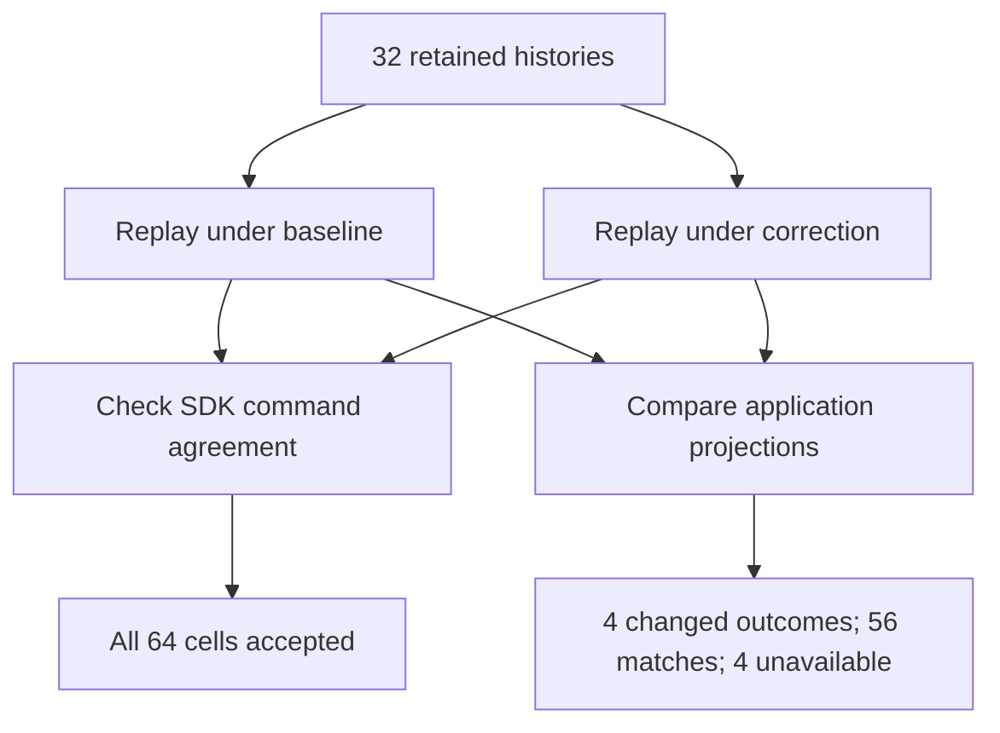

# Upgrade replay: command agreement is weaker than application agreement

[Case study](../../RESEARCH.md) · [Protocol v3](upgrade-protocol.md) · [Retained evidence](upgrade-evidence.json.gz)

## Result

**All 64 cross-version matrix cells passed Temporal replay. Four cells nevertheless
reconstructed a different caller outcome and tool-start count.** Those four cells
are two scenarios replayed in both directions, not four independent defects.
All same-version application controls matched wherever a final oracle was available.

| History source | Replay implementation | Command-compatible | Application matches | Application mismatches | No final application oracle |
| --- | --- | --- | --- | --- | --- |
| baseline | baseline | 16 / 16 | 15 | 0 | 1 |
| baseline | corrected | 16 / 16 | 13 | 2 | 1 |
| corrected | baseline | 16 / 16 | 13 | 2 | 1 |
| corrected | corrected | 16 / 16 | 15 | 0 | 1 |

The unavailable cell in each row is workflow cancellation: v2 retained a server
terminal and pre-cancel state, but no final application observation. It is not
counted as an application match. The two caller scenarios respectively re-raise
or suppress the second cancellation of evaluator cleanup.

| Projection | Original baseline history | Same history, corrected replay |
| --- | --- | --- |
| Accepted decision | approved | approved |
| Caller outcome | dispatched | cancelled |
| Tool-start events | 1 | 0 |
| Evaluation terminal events | 1 | 1 |

The reverse replay changes the last invocation outcome back to dispatched and
reconstructs one tool start. This is a diagnostic of changed behavior, not a
recommendation to roll back the correction.

## What the experiment establishes

Let $C(h,v)$ mean that SDK replay accepts history $h$ under implementation $v$.
Let $P(h,v)$ be the observed projection
$\langle decision,callerOutcome,toolStarts,evaluationTerminals\rangle$.
For these histories, the measurements provide witnesses to

$$C(h,v_0)\land C(h,v_1)\land P(h,v_0)\ne P(h,v_1).$$

Consequently, command compatibility alone does not establish the stronger obligation
$P(h,v_0)=P(h,v_1)$. Decision stability and audit-terminal count can both hold while
the invocation outcome changes. No TLA+ model was changed or credited with discovery
in this experiment; this is a separately declared test of an evidence boundary.



**Figure.** Two independent questions are asked of the same history/version cells.
Each cell is additionally replayed without the observer, for 128 replay executions
over 32 distinct histories. Every observer-free classification agrees with its pair.

## Mechanism and practical scope

The probe tool is a workflow-local function that returns a string; it schedules no
activity or child workflow and makes no external call. The two caller histories
contain no activity-scheduled event. Reconstructing a different local tool-start
event therefore need not produce an incompatible activity command. This explains
why the application comparison adds information for this probe.

This is **not a Temporal determinism defect**, evidence of duplicated external effects,
or a new implementation defect. The change is the intended correction of the known
caller-cancellation defect. The result qualifies the evidence needed to assess a
deployment: same-version replay, or even successful cross-version command replay,
cannot substitute for explicitly checking the application obligations of interest.
An activity-backed tool may produce a different command outcome; it was not tested.

For maintainers, review cancellation semantics and the rollout contract separately
from replay success. This offline experiment does not authorize or validate deploying
the patch to in-flight workflows. For scientific review, the contribution is a
reproducible distinction between two measured guarantees, not a claim that replay
limitations or semantic regression testing are novel.

## Evidence and reproduction

The measured local execution used commit `f4a4285ac14d474121b5204760e69b476e6e742d` on 2026-10-09,
Python 3.12.14 and Temporal SDK 1.32.0. The frozen protocol predates the pilot;
its observer-control amendment records what changed before the retained measurement.

**[GitHub Actions run 37933221643](https://github.com/charifmahmoudi/temporal-agent-harness/actions/runs/37933221643) reproduced every categorical
outcome** at head revision `ec155143903b75633ac9f82e1cf6f9f788804e83`,
using Python 3.12.3 and Temporal SDK 1.32.0. The separate [CI evidence archive](upgrade-ci.zip)
and [provenance record](upgrade-ci.json) retain all 64 cells and 128 replay executions.
The report checker verifies their history/source hashes and original/reconstructed
projections against the local measurement; runtime values are allowed to differ.
The connected GitHub app published identical local trees with different commit IDs;
the original local execution commit remains unchanged in the local evidence.

Initial publication required explicit user approval. The first workflow run failed
YAML parsing before execution; correcting a quoted command enabled the successful
run above. Neither interruption is scored as a replay result or scientific finding.

The compressed JSON retains every original and reconstructed projection, terminal
observation, error classification, runtime, history digest, and source/tooling hash.
Two altered-outcome controls were rejected; seven scoring unit tests passed.
The paired replay controls test classification stability, not full noninterference.
The [CI workflow](../../.github/workflows/upgrade-replay.yml) runs the same commands:

```bash
uv run --frozen pytest tests/evaluation/test_upgrade_projection.py -q
uv run --frozen python research/scripts/replay_upgrade.py --root "$PWD" \
  --variant baseline --output research/results/upgrade/baseline.json
python research/scripts/prepare_cancellation_variant.py \
  --output research/results/cancellation-corrected
cd research/results/cancellation-corrected
../../../.venv/bin/python ../../scripts/replay_upgrade.py --root ../../.. \
  --variant corrected --output ../upgrade/corrected.json
```

From the repository root, `python research/scripts/render_upgrade.py --check` verifies
the retained evidence and generated report. No test server is required for replay.

## Remaining decision gates

1. Test an activity-backed probe and in-flight upgrade under a separately declared
   protocol; assess any required versioning strategy against actual commands.
2. Obtain independent scrutiny of the projection and cancellation contract, and
   maintainer feedback on the isolated correction.

These results do not establish exhaustive history coverage, crash recovery,
cross-framework generality, external-effect safety, or conference-level novelty.
They preserve the v1 comparison and v2 cancellation results unchanged.
