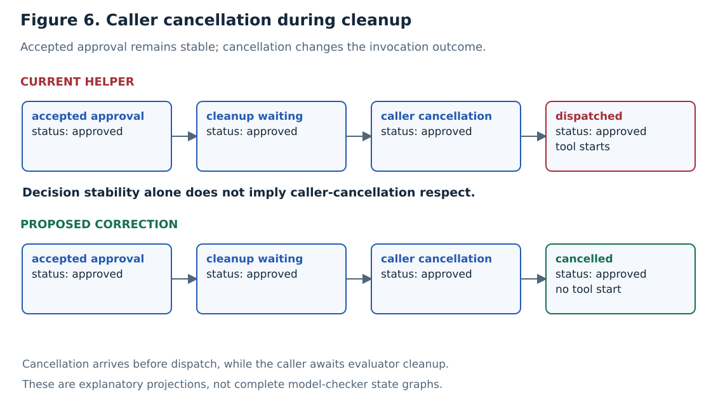

# Cleanup: settlement, progress, and caller cancellation

[Case study](../../../RESEARCH.md) · [Protocol v2](../../evaluation/cancellation-protocol.md) · [Measured results](../../evaluation/cancellation-results.md) · [Specification](Cleanup.tla)

## Purpose

This one-call extension of Approval separates **accepted permission** from the
**outcome of the waiting invocation**. Cancelling a caller during evaluator cleanup
should prevent that invocation from dispatching, even though approved status remains.
Close is a session flag; it is not caller-task cancellation or workflow cancellation.

**Figure 6.** Illustrative projections of the current and proposed paths. The approval
is retained in both. The last caller outcome differs. This is not a complete TLC
state graph; concrete evidence and actual counterexamples are reported separately.

## State and actions

The base vector $v$ retains Approval's seven fields. The extension uses

$$u=\langle v,callerCancelled,outcome,cleanupPending\rangle.$$

`callerCancelled` is initially false. `outcome` is initially `none`, then may become
`dispatched`, `rejected`, or `cancelled`. Base phase gains `aborted` for a cancelled
invocation. The supported configuration has exactly one call.
`cleanupPending` records whether the superseded evaluator was still running when
Consume executed. An already-completed task cannot introduce an unbounded cleanup
wait: FinishCleanup stays enabled for it even if CleanupCanFinish is FALSE.

| Action | State change | Concrete boundary / assumption |
| --- | --- | --- |
| Environment | Human decision, evaluator completion, or Close; extension fields unchanged | Existing Approval input actions |
| ConsumeStep | Base Consume; record whether its task was running | Runner observes accepted settlement or closure |
| FinishCleanup | Base Cancelled when cleanup can finish or no running cleanup was awaited | Evaluator cleanup terminates |
| CancelCaller | Mark caller cancellation; stop child; enter gate or aborted | Cancellation reaches waiting caller and child response ends that await |
| FinalizeStep | Base Finalize and corresponding caller outcome | Invocation passes gate or is denied |

`SwallowCallerCancel = TRUE` selects the current helper projection: CancelCaller
leaves the caller at the gate. FALSE selects the proposed propagation behavior:
CancelCaller records `cancelled` and enters `aborted`. It does not revoke status.
The action abstracts both child responses exercised concretely: re-raising the
second cancellation and suppressing it with a returned verdict.

## Obligations and witnesses

Existing decision stability, single resolution, approved dispatch, and denied
non-dispatch obligations remain checked. They do **not** imply cancellation respect:
an approved dispatch after caller cancellation can satisfy all four.

$$\Box(callerCancelled\Rightarrow outcome\ne dispatched).$$

`CallerCancellationRespected` is the above invariant. The current configuration can
violate it; the corrected projection must preserve it. Cancellation only enters this
model while running cleanup is awaited, before dispatch, so the invariant does not assert
rollback of an effect that already happened.

$$((\exists c\in C:status[c]\ne pending)\lor closed)\leadsto(outcome\ne none).$$

`CleanupProgress` is conditional on weak fairness of ConsumeStep, FinishCleanup,
and FinalizeStep. If `CleanupCanFinish = FALSE` and running cleanup is pending, FinishCleanup is disabled; fairness
cannot force a disabled action. A behavior can therefore retain an accepted decision
while cleanup waits forever. This explains the earlier fairness assumption instead
of assuming that every evaluator must terminate.

## Configuration inventory

| Configuration | Expected result |
| --- | --- |
| CurrentSafety | Base safety preserved |
| CurrentCancellation | CallerCancellationRespected violated |
| CorrectedCancellation | Base safety and caller cancellation respected |
| CurrentProgress | Conditional progress with finishing cleanup |
| BlockedProgress | Temporal-property counterexample with disabled cleanup |
| CorrectedProgress | Conditional progress with finishing cleanup |

The [runner](../../scripts/check_cancellation_model.py) generates these configurations
and requires the named invariant or temporal failure, rather than crediting tool
errors. It pins TLA+ tools v1.8.0 and retains configurations and logs.
Every configuration also checks ReadyTaskNotBlocked (a completed task leaves
FinishCleanup enabled) and PendingCleanupPhase (pending cleanup is in the cancellation
phase). These consistency obligations prevent a spurious blocked-completed-task witness.

## Limits

There is no arbitrary-call argument, workflow-cancellation model, activity-heartbeat
model, deadline bound, mixed-version upgrade, or external-effect rollback claim.
CancelCaller assumes the child's second-cancellation response completes; a child
that suppresses every cancellation indefinitely remains outside that action's
progress guarantee. Temporal experiments and replay are separate correspondence
evidence, not a universal refinement proof.
