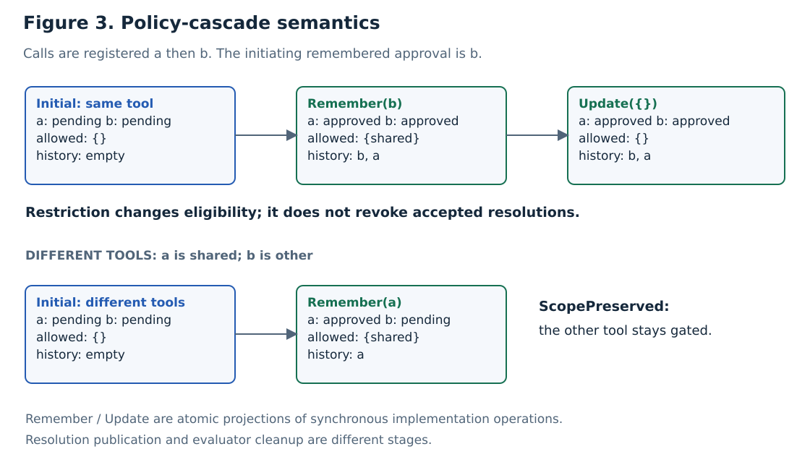

# Cascade: remembered approval and live policy changes

[Case study](../../../RESEARCH.md) · [Properties](../../properties.md) · [Executable specification](Cascade.tla)

## Purpose

Cascade extends Approval with two coupled calls. Approving one call with “remember”
adds its tool name to the live allow-list and synchronously releases eligible pending
calls. Replacing policy may relax or restrict eligibility. Settled decisions survive
both operations.

**Figure 3.** In the upper example, b initiates the resolution even though a registered
first. Its publication precedes a's. Restriction later removes eligibility without
revocation. In the lower example, a's remembered tool does not release b's other tool.
These are illustrative transitions, not recorded TLC counterexamples.

## Additional state

$$w=\langle v,allowed,history,causes,scopeViolation\rangle.$$

| Symbol | Definition or domain | Purpose |
| --- | --- | --- |
| `ToolOf[c]` | Tool name for call c | Eligibility identity; does not depend on registration order |
| `CallOrder` | a,b or b,a | Evidenced registration order |
| `allowed` | Subset of represented tool names | Live allow-list; initially empty |
| `history` | Sequence of call IDs | Resolution publication order; initially empty |
| `causes` | Set of ordered call pairs | Observer: initiating remembered call and released sibling |
| `scopeViolation` | Boolean | Observer: whether any cascade released an ineligible sibling |

For normal configurations, define the eligible pending set

$$T(P)=\{c\in C\mid status[c]=pending\land ToolOf[c]\in P\}.$$

## Atomic actions

| Action | Definition | Publication order |
| --- | --- | --- |
| `BaseStep` | Execute an Approval action and append newly resolved calls to history. | Registration order for the resolved entries |
| `Remember(c)` | Require pending c; set $P=allowed\cup\{ToolOf[c]\}$; approve c and $T(P)\setminus\{c\}$; preserve every other status. | Initiator c, then eligible siblings in registration order |
| `Update(P)` | Install P; approve $T(P)$; preserve every settled decision. | Eligible pending entries in registration order |

In particular, normal policy replacement satisfies

$$
status'[c]=\begin{cases}approved & c\in T(P),\\status[c]&c\notin T(P).\end{cases}
$$

Changing the allow-list to empty therefore cannot undo an earlier approval.
A denial carrying “remember” uses the ordinary human-denial action and does not
change policy.

Remember and Update each represent one synchronous operation. Intermediate raw
publications are retained as event evidence; snapshots are taken at the operation
boundary. No observation adds a suspending await to the production policy path.

## Specification and obligations

`CascadeNext` is BaseStep, Remember, or Update; `CascadeSpec` uses the standard
initial-state and always-next form. It inherits Approval safety and adds type
consistency, `ScopePreserved`, and `CauseBeforeCascade`. Conditional progress assumes
weak fairness of the inherited consume, cleanup, and finalization actions.
The [property catalogue](../../properties.md) gives exact formulas and fault controls.

## Bounds

Two registered calls are checked with the same tool or different tools, under both
registration orders. Auto mode remains enabled, skip-all is disabled, and tools are
not inherently safe. Future bypassing calls, argument-specific grants, criteria/mode
changes, replay, and arbitrary call counts are excluded. Tool-name remembering can
cover other arguments of the same tool; this is not an argument-specific permission.

[Code correspondence](../../correspondence.md) defines the input-constrained checker.
[Evidence and reproduction](../../evidence.md) lists the twelve execution scenarios,
model configurations, and retained artifacts.
