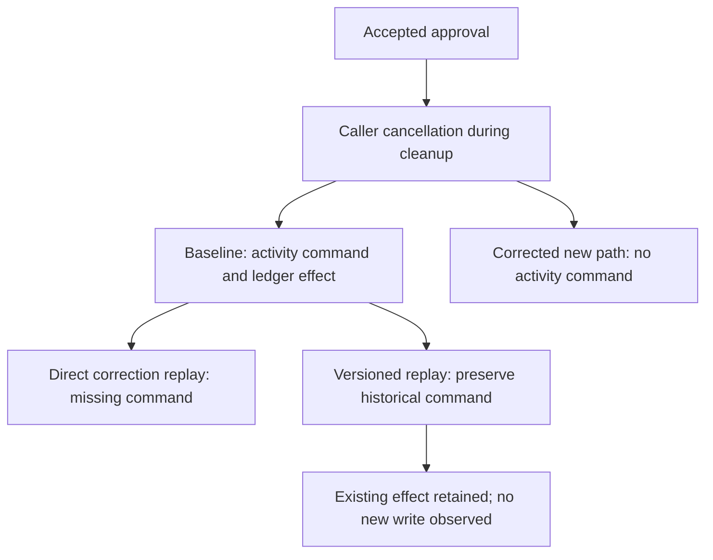
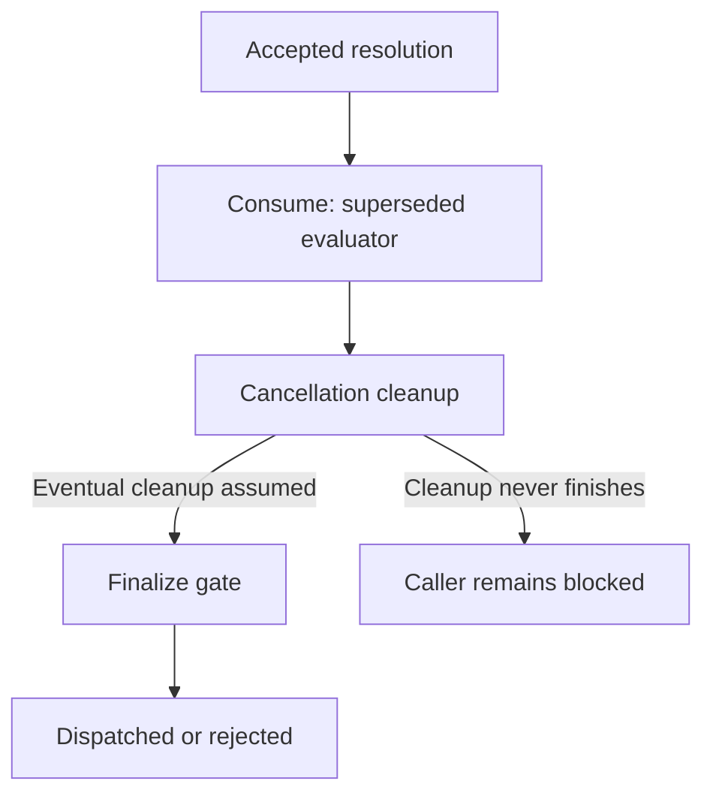

# Property catalogue

[Case study](../RESEARCH.md) · [Approval](models/approval/README.md) · [Cascade](models/cascade/README.md)

## Notation and interpretation

$c\in C$ identifies a call. $s_c$, $f_c$, $n_c$, and $p_c$ abbreviate `status[c]`,
`first[c]`, `resolutions[c]`, and `phase[c]`. $h$ is publication history and $K$ is
`causes`. $\Box I$ means that invariant I holds in every reachable state.
$A\leadsto B$ means that whenever A holds, B eventually holds.

Safety forbids a bad state or history. It does not guarantee termination. Conditional
liveness supplies eventual progress only under the listed fairness assumptions.
The operator names below exactly match the executable TLA+ specifications.

## Checked obligations

| ID / operator | Mathematical obligation | Meaning and violating example |
| --- | --- | --- |
| P1 `DecisionStable` | $\Box(\forall c\in C:f_c\ne none\Rightarrow s_c=f_c)$ | Preserve the first resolution. Violation: approved becomes denied while first remains approved. |
| P2 `SingleResolution` | $\Box(\forall c\in C:n_c\le1)$ | At most one resolution per call. Violation: a settled entry is resolved again. |
| P3 `AuthorizedDispatch` | $\Box(\forall c\in C:p_c=dispatched\Rightarrow s_c=approved)$ | Dispatch requires approval. Violation: a pending call dispatches through a bypass. |
| P4 `DeniedNeverDispatches` | $\Box(\forall c\in C:s_c=denied\Rightarrow p_c\ne dispatched)$ | Denial excludes dispatch. P3 and the disjoint status domain imply this; it is retained as a diagnostic check. |
| P5 `ResolutionProgress` | $\forall c\in C:(s_c\ne pending\lor closed)\leadsto(p_c\in\{dispatched,rejected\})$ | A decided/closed call eventually finishes under fairness. Unbounded cancellation cleanup can prevent progress in the implementation. |
| P6 `ScopePreserved` | $\Box\neg scopeViolation$ | No policy action releases an ineligible sibling. This is a history monitor; approved does not imply currently allow-listed after restriction. |
| P7 `CauseBeforeCascade` | $\Box(\forall(c,d)\in K:\exists i,j\in1..Len(h):i<j\land h_i=c\land h_j=d)$ | A remembered decision publishes before the sibling it releases. Violation: remember b publishes a before b. |
| P8 `CallerCancellationRespected` | $\Box(callerCancelled\Rightarrow outcome\ne dispatched)$ | In Cleanup's one-call extension, cancellation received during cleanup prevents dispatch. Violation: status remains approved, but a cancelled caller continues to tool execution. |
| P9 `CleanupProgress` | $((\exists c\in C:s_c\ne pending)\lor closed)\leadsto(outcome\ne none)$ | Invocation eventually completes only with cleanup termination and scheduling assumptions. Unlike P5, cancelled is an explicit terminal outcome. |

`TypeOK` checks variable domains in Approval. `CascadeTypeOK` additionally checks
allow-list, history, cause-pair, and monitor domains. Type checks are consistency
obligations, rather than application authorization guarantees.

P8 and P9 belong to the [Cleanup extension](models/cancellation/README.md), rather than
the original Approval/Cascade trace checkers. The [measured finding](evaluation/cancellation-results.md)
demonstrates why P1–P4 do not imply P8. Figure 6 in the extension contrasts their
concrete caller outcomes. Exactly one superseded evaluation terminal is also checked
by the implementation experiment; that audit obligation is not encoded in Cleanup.

**Figure 2.** Each row contrasts a valid trace with a selected synthetic violation.
The dispatch row suppresses lifecycle intermediates. The ordering row illustrates
publications inside the atomic Remember action; its interior is not a separate model
state. Thus the diagram explains the obligation without altering the model's atomicity.

## Empirical obligations at the activity and upgrade boundary

These obligations are checked by the [activity-backed experiment](evaluation/activity-results.md).
They are **not additional TLA+ invariants** or a claimed refinement of Cleanup.
For invocation i, D(i) means cancellation delivered during evaluator cleanup and
S(i) means a scheduled activity command. R(h,v) means SDK command-compatible replay
of a retained history h under implementation variant v.

| Obligation | Formal statement / observation | Evidence and limit |
| --- | --- | --- |
| E1: prevent new activity scheduling | $D(i)\Rightarrow\neg S(i)$ on the corrected new path | B violates it in both caller scenarios; C/V satisfy it in the selected fresh and pre-cancellation replacement cases. Approval remains accepted. |
| E2: preserve baseline command history | $\forall h\in H_B:R(h,V)$ for the four retained baseline histories | V passes; C fails the two baseline caller histories. This is finite history compatibility, not universal replay correctness. |
| E3: no repeated probe effect during tested recovery | Ledger count after terminal cleanup equals count before replacement | Holds in the eight live cases. A preexisting ledger write remains; no rollback or general exactly-once guarantee is established. |

E1 applies to new execution at the versioned branch. It is not retrospectively asserted
of baseline commands reconstructed during replay. This distinction is necessary to
state E1 and E2 consistently. The full matrix shows that baseline-compatible V is
not compatible with every unmarked history produced by the direct correction C.

**Activity-boundary obligations.** P1 decision stability can hold on every branch
while E1 fails on the baseline path. E2 preserves recorded behavior; it does not
retroactively repair the earlier E1 violation.

## Progress assumptions

Approval's fair specification adds, for every call,

$$WF_v(Consume(c))\land WF_v(Cancelled(c))\land WF_v(Finalize(c)).$$

`WF` is weak fairness: an action that remains enabled cannot be postponed forever.
Cascade applies the corresponding fairness clauses to its inherited BaseStep actions.
Fairness of Cancelled expresses eventual cleanup; the model does not prove that an
arbitrary custom evaluator terminates its cancellation handler.

Cleanup makes this assumption explicit through `CleanupCanFinish`. With FALSE,
FinishCleanup is disabled: weak fairness cannot make it terminate, and TLC produces
an infinite stuttering counterexample to P9. The controlled Temporal executions retain
finite blocked prefixes and subsequently release cleanup; they do not demonstrate
infinite runtime nontermination.

**Figure 5.** The lower branch explains the implementation limitation. The fair model
excludes indefinite postponement of its enabled cleanup-completion action.

## How the checks can fail

| Synthetic model fault | Required detector |
| --- | --- |
| Re-resolve a settled Approval call | SingleResolution |
| Bypass an unresolved gate | AuthorizedDispatch |
| Release another tool regardless of eligibility | ScopePreserved |
| Re-resolve a settled Cascade call | SingleResolution |
| Publish sibling before remembered initiator | CauseBeforeCascade |

These five controls must fail with their named invariant. Their expected failures
make the verification job pass; an unrelated parser error or timeout does not count.
Implementation mutations and invalid-trace controls are separate experiments,
described in [Evidence](evidence.md). Passing any of these checks remains a bounded
result rather than a proof of the Python implementation.
