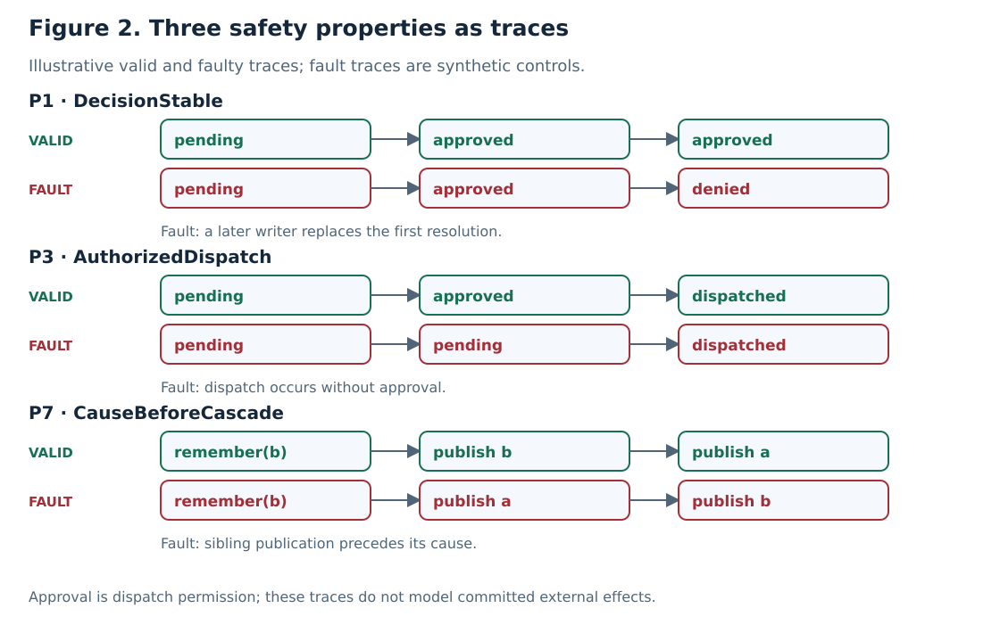
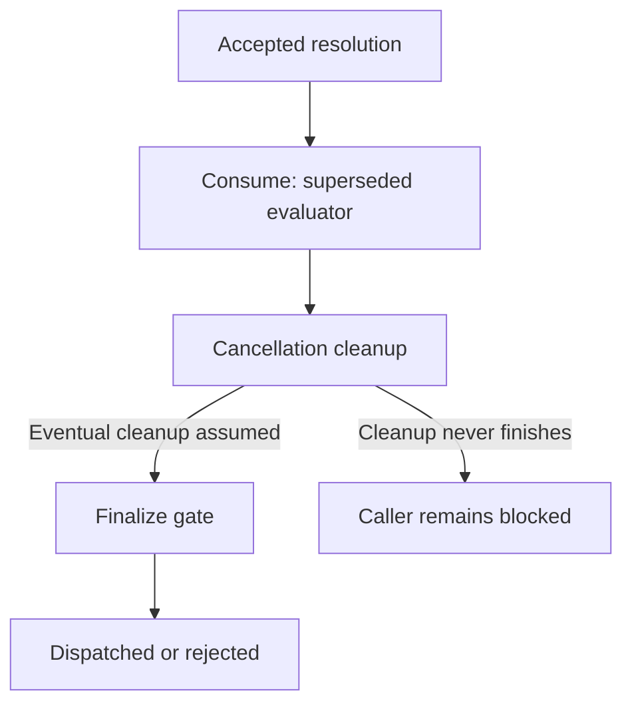

# Property catalogue

[Case study](../RESEARCH.md) · [Approval](models/approval/README.md) · [Cascade](models/cascade/README.md)

## Notation and interpretation

$c\in C$ identifies a call. $s_c$, $f_c$, $n_c$, and $p_c$ abbreviate `status[c]`,
`first[c]`, `resolutions[c]`, and `phase[c]`. $h$ is publication history and $K$ is
`causes`. $\Box I$ means that invariant I holds in every reachable state.
$A\leadsto B$ means that whenever A holds, B eventually holds.

Safety forbids a bad state or history. It does not guarantee termination. Conditional
liveness supplies eventual progress only under the listed fairness assumptions.
The operator names below exactly match the executable TLA+ specifications.

## Checked obligations

| ID / operator | Mathematical obligation | Meaning and violating example |
| --- | --- | --- |
| P1 `DecisionStable` | $\Box(\forall c\in C:f_c\ne none\Rightarrow s_c=f_c)$ | Preserve the first resolution. Violation: approved becomes denied while first remains approved. |
| P2 `SingleResolution` | $\Box(\forall c\in C:n_c\le1)$ | At most one resolution per call. Violation: a settled entry is resolved again. |
| P3 `AuthorizedDispatch` | $\Box(\forall c\in C:p_c=dispatched\Rightarrow s_c=approved)$ | Dispatch requires approval. Violation: a pending call dispatches through a bypass. |
| P4 `DeniedNeverDispatches` | $\Box(\forall c\in C:s_c=denied\Rightarrow p_c\ne dispatched)$ | Denial excludes dispatch. P3 and the disjoint status domain imply this; it is retained as a diagnostic check. |
| P5 `ResolutionProgress` | $\forall c\in C:(s_c\ne pending\lor closed)\leadsto(p_c\in\{dispatched,rejected\})$ | A decided/closed call eventually finishes under fairness. Unbounded cancellation cleanup can prevent progress in the implementation. |
| P6 `ScopePreserved` | $\Box\neg scopeViolation$ | No policy action releases an ineligible sibling. This is a history monitor; approved does not imply currently allow-listed after restriction. |
| P7 `CauseBeforeCascade` | $\Box(\forall(c,d)\in K:\exists i,j\in1..Len(h):i<j\land h_i=c\land h_j=d)$ | A remembered decision publishes before the sibling it releases. Violation: remember b publishes a before b. |

`TypeOK` checks variable domains in Approval. `CascadeTypeOK` additionally checks
allow-list, history, cause-pair, and monitor domains. Type checks are consistency
obligations, rather than application authorization guarantees.

**Figure 2.** Each row contrasts a valid trace with a selected synthetic violation.
The dispatch row suppresses lifecycle intermediates. The ordering row illustrates
publications inside the atomic Remember action; its interior is not a separate model
state. Thus the diagram explains the obligation without altering the model's atomicity.

## Progress assumptions

Approval's fair specification adds, for every call,

$$WF_v(Consume(c))\land WF_v(Cancelled(c))\land WF_v(Finalize(c)).$$

`WF` is weak fairness: an action that remains enabled cannot be postponed forever.
Cascade applies the corresponding fairness clauses to its inherited BaseStep actions.
Fairness of Cancelled expresses eventual cleanup; the model does not prove that an
arbitrary custom evaluator terminates its cancellation handler.

**Figure 5.** The lower branch explains the implementation limitation. The fair model
excludes indefinite postponement of its enabled cleanup-completion action.

## How the checks can fail

| Synthetic model fault | Required detector |
| --- | --- |
| Re-resolve a settled Approval call | SingleResolution |
| Bypass an unresolved gate | AuthorizedDispatch |
| Release another tool regardless of eligibility | ScopePreserved |
| Re-resolve a settled Cascade call | SingleResolution |
| Publish sibling before remembered initiator | CauseBeforeCascade |

These five controls must fail with their named invariant. Their expected failures
make the verification job pass; an unrelated parser error or timeout does not count.
Implementation mutations and invalid-trace controls are separate experiments,
described in [Evidence](evidence.md). Passing any of these checks remains a bounded
result rather than a proof of the Python implementation.
